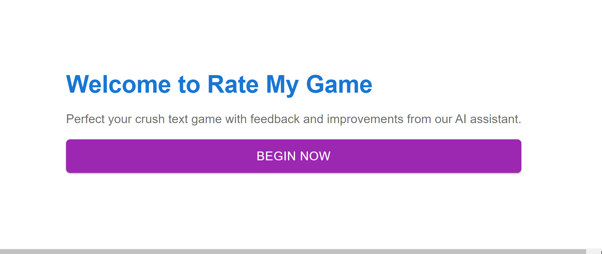
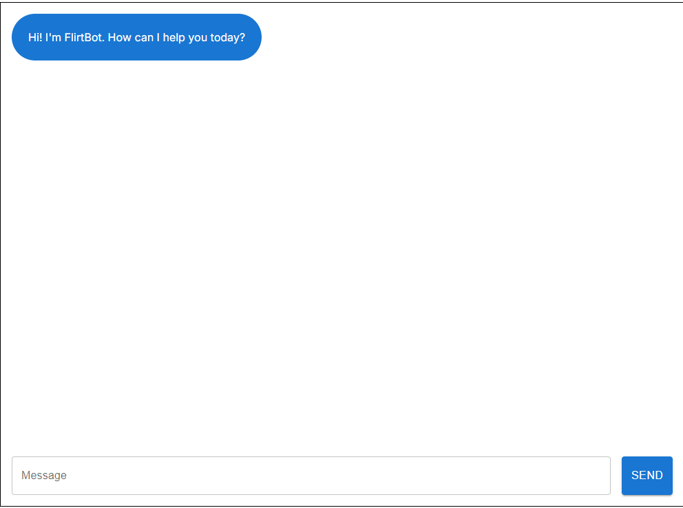
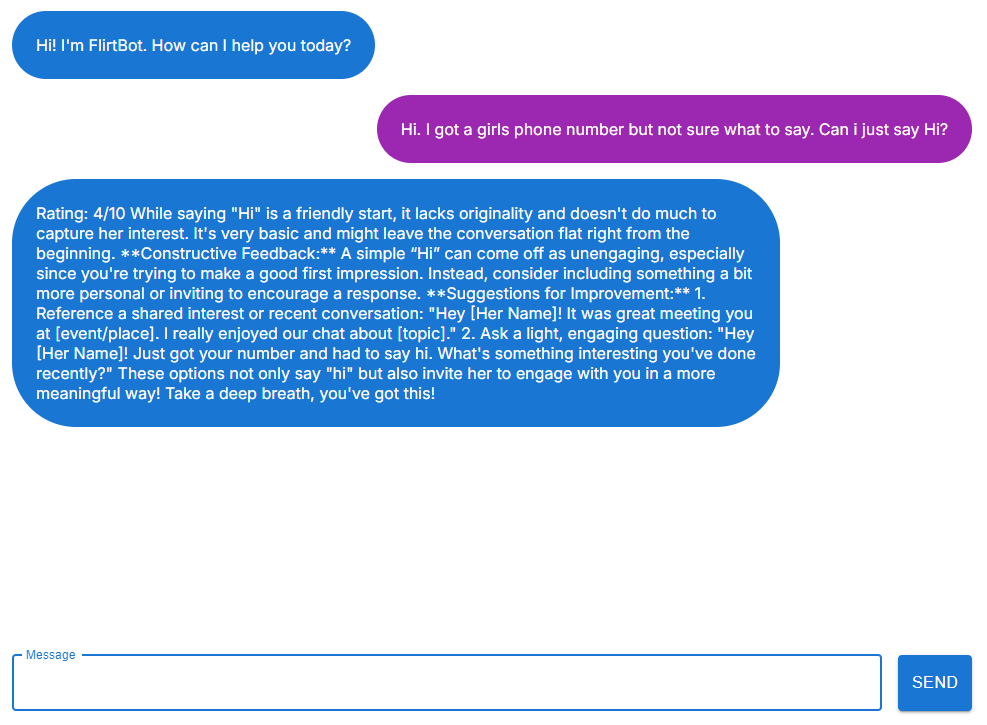

# FlirtBot

FlirtBot is a web application designed to help users improve their text game when flirting with a crush. Using advanced AI, the bot provides feedback, rates users' messages, and suggests improvements to increase the chances of a positive response. The app is built using Next.js, Node.js, and is hosted on both Vercel and an AWS EC2 instance.

## Features

### 🧠 AI-Powered Feedback
FlirtBot analyzes your text messages and provides constructive feedback. It rates your messages on a scale of 1-10 based on how effective they are in flirting or conveying romantic interest.

### 💬 Message Rating
- **Rate Your Lines:** Receive a score out of 10 for the effectiveness of your text.
- **Detailed Feedback:** Get detailed explanations on why your text received a particular score and how it can be improved.

### 🔄 Suggestive Improvements
- **Alternative Suggestions:** FlirtBot suggests alternative text messages that could potentially lead to a better outcome.
- **Context-Sensitive:** The bot tailors its feedback based on the context of your conversation, making sure the advice is relevant.

### 💻 Responsive Design
- **Mobile Friendly:** The application is designed to look great and function smoothly on all screen sizes, from mobile phones to desktop monitors.
- **Easy Navigation:** A clean and intuitive interface that makes it easy for users to interact with the bot.

### **Landing Page**

The welcoming screen where users can start their journey with FlirtBot.

### **Chat Interface**

The main interface where users interact with FlirtBot, receive feedback, and get suggestions on improving their texts.

### **Rating Feedback**

An example of the rating and feedback provided by FlirtBot for a user's message.

## Using FlirtBot

FlirtBot is live and accessible to everyone! You can start improving your texting skills right now by visiting [https://flirtbot.vercel.app/](https://flirtbot.vercel.app/).

## Future Plans

### 🌐 Domain and SSL Integration
- **Domain Name:** Plan to purchase and integrate a domain name to replace the IP-based URL.
- **SSL Certificate:** Enable HTTPS using SSL/TLS to secure communication between the user and the server.

### 🔗 Social Media Sharing
- **Shareable Links:** Implement functionality allowing users to share their FlirtBot ratings and suggestions on social media platforms.

### 🧩 Additional Features
- **Advanced Analytics:** Provide users with more detailed analytics on their conversation history, helping them track improvements over time.
- **Customization:** Allow users to customize the tone and style of the bot's responses (e.g., playful, serious, casual).

### 📱 Mobile App
- **React Native App:** Develop a mobile app using React Native to extend FlirtBot’s reach and provide a seamless user experience on smartphones.
